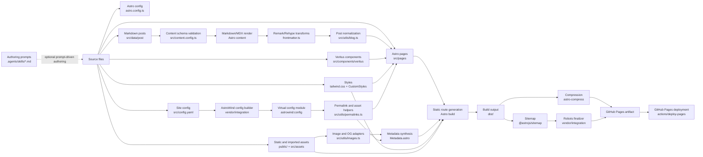
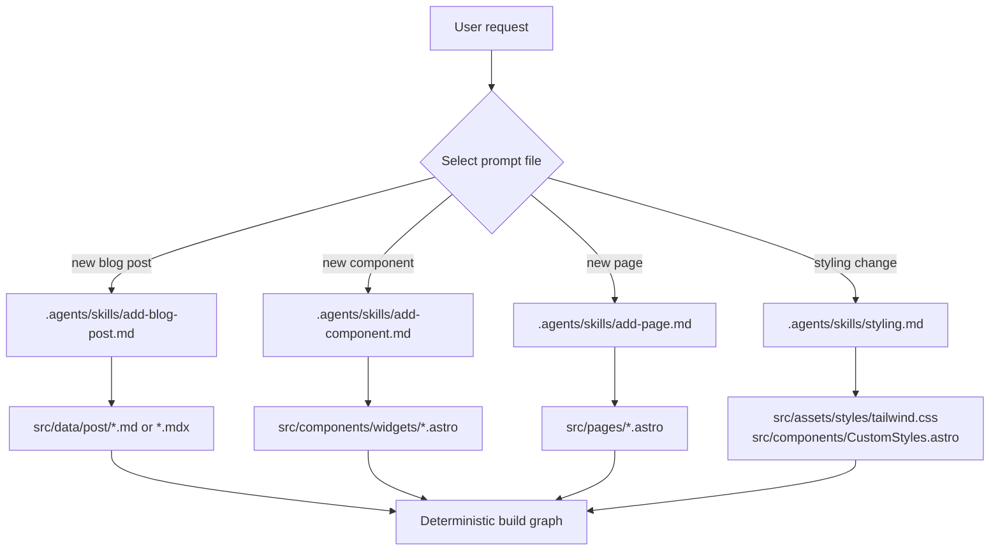
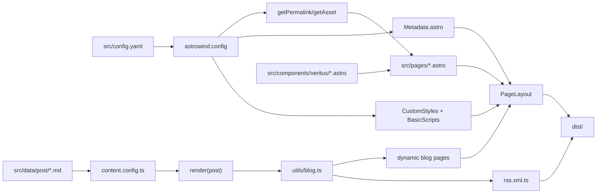
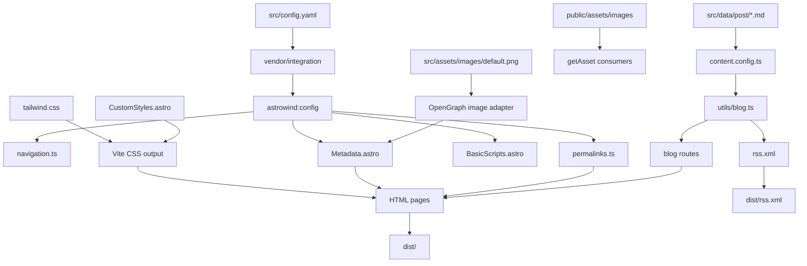
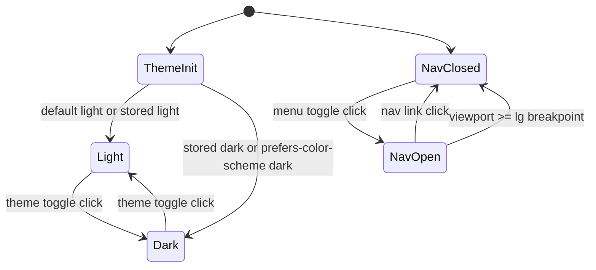

# Veritus Automation Website Engineering White Paper

## 1. Executive Summary

This document describes the Veritus Automation website as an engineering system. The project is an Astro static site based on AstroWind, then heavily customized with Veritus-specific pages, components, visual assets, typography, theme tokens, navigation, and GitHub Pages deployment configuration.

The system has two distinct workflow classes:

1. **Production build workflow**
   This is deterministic. Astro, Vite, Tailwind CSS, the local AstroWind integration, content loaders, Markdown processors, image optimizers, and deployment actions transform source files into static HTML, CSS, JavaScript, images, metadata, sitemap files, and robots metadata.

2. **Authoring workflow**
   This is prompt-driven only when an AI coding assistant uses local Markdown skill prompts under `.agents/skills/`. These prompt files do not run at build time. They shape how a human or assistant creates new pages, components, blog posts, or styling changes before the deterministic build pipeline consumes the resulting source files.

The production artifact is a static website intended for GitHub Pages:

```txt
https://vs-scratchpad.github.io/veritus-auto-v2/
```

The configured Astro deployment values are:

```ts
site: 'https://vs-scratchpad.github.io';
base: '/veritus-auto-v2';
```

## 2. Repository Scope

The relevant project roots are:

```txt
astro.config.ts
src/config.yaml
src/pages/
src/components/
src/components/veritus/
src/layouts/
src/navigation.ts
src/data/post/
src/assets/
public/assets/
vendor/integration/
.agents/skills/
.github/workflows/deploy.yml
```

The site is static. There is no server-side runtime API, no database, and no live form submission backend in the inspected project.

## 3. System Topology

At a high level, the website build is a graph of configuration, content, components, styling, assets, metadata, and deployment nodes.



### Edge Types

| Edge type          | Meaning                                                                | Example                                                      |
| ------------------ | ---------------------------------------------------------------------- | ------------------------------------------------------------ |
| Source edge        | Source file is read by a build or render node.                         | `src/pages/index.astro` consumed by Astro route generation   |
| Configuration edge | A config value controls downstream path, metadata, or plugin behavior. | `src/config.yaml.site.base` controls `getPermalink()`        |
| Artifact edge      | A node emits a generated file or optimized asset.                      | `Metadata.astro` emits SEO tags                              |
| Control edge       | A node changes build or deployment behavior.                           | `.github/workflows/deploy.yml` triggers deployment on `main` |
| Prompt edge        | An authoring prompt shapes source creation before build time.          | `.agents/skills/add-page.md` guides a new Astro page         |

## 4. Runtime and Build-Time Prompt Boundary

There are no runtime prompt calls and no build-time LLM calls in the project. The only prompt-driven transformations are optional human or AI assistant authoring flows defined in Markdown files:

```txt
.agents/skills/add-blog-post.md
.agents/skills/add-component.md
.agents/skills/add-page.md
.agents/skills/styling.md
```

These files act as authoring instructions. They shape source files before the deterministic Astro build begins. Once source files exist, the production build is deterministic.

## 5. Node Specifications

### N0. Authoring Prompt Dispatcher

**Responsibility**

Guide optional AI-assisted or human-assisted edits before source files enter the build graph.

**Upstream dependencies**

- User intent.
- Existing repository structure.
- Markdown prompt files in `.agents/skills/`.

**Inputs**

- A requested authoring operation, such as "add a page", "add a component", "add a blog post", or "adjust styling".
- Relevant local prompt file.

**Outputs**

- New or modified source files in `src/pages/`, `src/components/`, `src/data/post/`, or style files.

**Transformation performed**

Prompt-driven authoring. The prompt constrains file placement, component conventions, frontmatter, styling tokens, and validation steps.

**Prompt files**

- `.agents/skills/add-page.md`
  Defines how to create a page under `src/pages/`, which layout to use, and how to compose widgets.
- `.agents/skills/add-component.md`
  Defines how to create widget components and expected Astro component conventions.
- `.agents/skills/add-blog-post.md`
  Defines Markdown/MDX post creation, required frontmatter, and build verification.
- `.agents/skills/styling.md`
  Defines Tailwind v4 token usage, dark mode conventions, custom utilities, and font/color change rules.

**Role of the prompt**

The prompt does not produce runtime output directly. It shapes the authoring behavior that creates source artifacts. Those source artifacts are later consumed by deterministic nodes.

**Assumptions and invariants**

- Prompt output must still be valid project source.
- Prompt instructions are conventions, not executable validation.
- The deterministic pipeline remains authoritative.

**Failure modes**

- Prompt-created source may violate TypeScript, Astro, ESLint, or Prettier rules.
- Prompt-created routes may not use `getPermalink()` or `getAsset()`, causing base-path defects.
- Prompt-created content may omit required frontmatter.

**Downstream consumers**

- N1 Source File Graph.
- N4 Content Collection Schema.
- N9 Page Composition.
- N13 Styling Pipeline.

---

### N1. Source File Graph

**Responsibility**

Represent all source-controlled project artifacts that feed the static site.

**Upstream dependencies**

- Authoring operations.
- Repository checkout.

**Inputs**

- Astro pages in `src/pages/`.
- Components in `src/components/` and `src/components/veritus/`.
- Config files in `astro.config.ts` and `src/config.yaml`.
- Markdown posts in `src/data/post/`.
- Local images and favicons in `src/assets/`.
- Public images/logos in `public/assets/`.
- Local integration code in `vendor/integration/`.

**Outputs**

- File graph consumed by Astro, Vite, Tailwind, content loaders, and GitHub Actions.

**Transformation performed**

Deterministic file discovery by the toolchain.

**Pseudocode**

```pseudo
function discoverSourceGraph(projectRoot):
    graph = {}
    graph.config = read("astro.config.ts")
    graph.siteConfig = read("src/config.yaml")
    graph.pages = glob("src/pages/**/*.{astro,md,mdx,ts}")
    graph.components = glob("src/components/**/*.{astro,ts}")
    graph.posts = glob("src/data/post/*.{md,mdx}")
    graph.assets = glob("src/assets/**/*") + glob("public/**/*")
    graph.integration = glob("vendor/integration/**/*.ts")
    graph.workflow = read(".github/workflows/deploy.yml")
    return graph
```

**Assumptions and invariants**

- `src/pages/` maps to routes.
- `src/data/post/` maps to the `post` content collection.
- `public/` files are copied to the output root.
- Source files are UTF-8 compatible.

**Validation rules**

- Astro page files must compile.
- Markdown frontmatter must satisfy collection schema.
- Imported assets must exist.

**Failure modes**

- Missing files.
- Broken imports.
- Invalid frontmatter.
- Unsupported file extensions.

**Downstream consumers**

- N2 Astro Configuration.
- N3 Site Configuration.
- N4 Content Collection Schema.
- N9 Page Composition.
- N13 Styling Pipeline.

---

### N2. Astro Configuration Loader

**Responsibility**

Load and apply top-level Astro, Vite, image, Markdown, and integration configuration from `astro.config.ts`.

**Upstream dependencies**

- N1 Source File Graph.

**Inputs**

- `astro.config.ts`.
- Imported integrations:
  - `@astrojs/sitemap`
  - `@astrojs/mdx`
  - `@astrojs/partytown`
  - `astro-icon`
  - `astro-compress`
  - local `vendor/integration`
  - Tailwind Vite plugin

**Outputs**

- Astro runtime config object.
- Vite alias config.
- Markdown processor config.
- Integration registration list.

**Transformation performed**

Deterministic config evaluation.

**Pseudocode**

```pseudo
function loadAstroConfig():
    config.output = "static"
    config.site = "https://vs-scratchpad.github.io"
    config.base = "/veritus-auto-v2"
    config.devToolbar.enabled = false
    config.integrations = [
        sitemap(),
        mdx(),
        icon(includeIconSets),
        maybePartytown(hasExternalScripts),
        compress(compressionOptions),
        astrowind({ config: "./src/config.yaml" })
    ]
    config.image.domains = ["cdn.pixabay.com"]
    config.markdown.processor = unified({
        remarkPlugins: [readingTimeRemarkPlugin],
        rehypePlugins: [responsiveTablesRehypePlugin]
    })
    config.vite.plugins = [tailwindcss()]
    config.vite.resolve.alias["~"] = projectRoot + "/src"
    return config
```

**Assumptions and invariants**

- `output` remains `static`.
- `base` is the GitHub Pages repository path.
- `site` is the GitHub Pages owner URL, not the repository URL.
- `~` resolves to `src`.

**Validation rules**

- Config must be valid ESM TypeScript.
- Integration packages must be installed.
- The site and base must produce valid absolute URLs.

**Failure modes**

- Bad import or missing dependency.
- Incorrect base path breaks internal links on GitHub Pages.
- Incorrect `site` breaks canonical URLs and sitemap.

**Downstream consumers**

- N3 AstroWind Integration.
- N5 Markdown Processor.
- N13 Styling Pipeline.
- N17 Static Route Generator.
- N20 Compression.
- N21 Sitemap Generation.

---

### N3. AstroWind Site Configuration and Virtual Module

**Responsibility**

Load `src/config.yaml`, merge defaults, and expose site, metadata, blog, UI, i18n, and analytics settings through `astrowind:config`.

**Upstream dependencies**

- N1 Source File Graph.
- N2 Astro Configuration Loader.

**Inputs**

- `src/config.yaml`.
- `vendor/integration/utils/loadConfig.ts`.
- `vendor/integration/utils/configBuilder.ts`.
- `vendor/integration/index.ts`.

**Outputs**

- Virtual module `astrowind:config`.
- Updated Astro config values:
  - `site`
  - `base`
  - `trailingSlash`

**Transformation performed**

Deterministic YAML load, default merge, and virtual module injection.

**Pseudocode**

```pseudo
function buildAstroWindConfig(path):
    raw = readFile(path)
    parsed = yaml.load(raw)

    SITE = merge(defaultSite, parsed.site)
    METADATA = merge(defaultMetadata(SITE), parsed.metadata)
    I18N = merge(defaultI18N, parsed.i18n)
    APP_BLOG = merge(defaultBlog, parsed.apps.blog)
    UI = merge(defaultUI, parsed.ui)
    ANALYTICS = merge(defaultAnalytics, parsed.analytics)

    updateAstroConfig({
        site: SITE.site,
        base: SITE.base,
        trailingSlash: SITE.trailingSlash ? "always" : "never"
    })

    exposeVirtualModule("astrowind:config", {
        SITE, I18N, METADATA, APP_BLOG, UI, ANALYTICS
    })
```

**Assumptions and invariants**

- `src/config.yaml.site.base` and `astro.config.ts.base` should agree.
- `metadata.robots.index` and `metadata.robots.follow` default to `false`.
- `ui.theme` controls initial theme behavior.

**Validation rules**

- YAML must parse.
- Required site name must exist.
- Blog config must be structurally compatible with `configBuilder.ts`.

**Failure modes**

- YAML syntax error.
- Divergent `base` values between config files.
- Missing values leading to incorrect metadata defaults.

**Downstream consumers**

- N8 Blog Normalization.
- N10 Permalink and Asset Resolution.
- N11 Layout Shell.
- N12 Metadata Synthesis.
- N15 Client Behavior Script.
- N22 Robots Finalizer.

---

### N4. Content Collection Schema

**Responsibility**

Validate Markdown and MDX posts in `src/data/post/` against the `post` collection schema.

**Upstream dependencies**

- N1 Source File Graph.
- Optional N0 prompt-driven blog authoring.

**Inputs**

- `src/content.config.ts`.
- Files matching `src/data/post/*.{md,mdx}`.

**Outputs**

- Validated `CollectionEntry<'post'>` objects.

**Transformation performed**

Deterministic schema validation with Astro Content Layer and Zod.

**Pseudocode**

```pseudo
function validatePostCollection():
    files = glob("src/data/post/*.{md,mdx}")
    entries = []
    for file in files:
        frontmatter = parseFrontmatter(file)
        assert optionalDate(frontmatter.publishDate)
        assert optionalDate(frontmatter.updateDate)
        assert optionalBoolean(frontmatter.draft)
        assert string(frontmatter.title)
        assert optionalString(frontmatter.excerpt)
        assert optionalString(frontmatter.image)
        assert optionalString(frontmatter.category)
        assert optionalArrayOfString(frontmatter.tags)
        assert optionalString(frontmatter.author)
        assert optionalMetadata(frontmatter.metadata)
        entries.append({ id: filename(file), data: frontmatter, body: markdownBody(file) })
    return entries
```

**Assumptions and invariants**

- `title` is required.
- `draft` posts must not appear in public listing output.
- `metadata.robots` values, if present, are booleans.

**Validation rules**

- Zod schema in `src/content.config.ts`.
- Astro content sync diagnostics.

**Failure modes**

- Missing title.
- Invalid date.
- Non-array `tags`.
- Invalid nested metadata shape.

**Downstream consumers**

- N5 Markdown and MDX Rendering.
- N8 Blog Normalization.

---

### N5. Markdown and MDX Rendering

**Responsibility**

Convert validated Markdown and MDX content into renderable Astro content components.

**Upstream dependencies**

- N4 Content Collection Schema.
- N2 Markdown processor config.

**Inputs**

- Validated post entries.
- Markdown body.
- MDX body, if present.
- Remark and Rehype plugins.

**Outputs**

- `Content` component for each post.
- `remarkPluginFrontmatter` with plugin-enriched frontmatter.

**Transformation performed**

Deterministic Markdown/MDX parsing and rendering.

**Pseudocode**

```pseudo
function renderPost(post):
    ast = parseMarkdownOrMdx(post.body)
    ast = applyRemarkPlugins(ast, post.file)
    hast = markdownAstToHtmlAst(ast)
    hast = applyRehypePlugins(hast)
    Content = compileAstroComponent(hast)
    return { Content, remarkPluginFrontmatter: post.file.data.astro.frontmatter }
```

**Assumptions and invariants**

- Markdown syntax is valid.
- MDX expressions, if used, compile in Astro.
- Remark plugins run before Rehype plugins.

**Validation rules**

- Astro content render must succeed.
- MDX components must be resolvable.

**Failure modes**

- Invalid MDX syntax.
- Broken component import in MDX.
- Plugin mutation does not write expected frontmatter.

**Downstream consumers**

- N6 Reading Time Remark Plugin.
- N7 Responsive Table Rehype Plugin.
- N8 Blog Normalization.
- N18 Blog Route Generation.

---

### N6. Reading Time Remark Plugin

**Responsibility**

Compute a rounded reading-time estimate from Markdown text and attach it to frontmatter.

**Upstream dependencies**

- N5 Markdown and MDX Rendering.

**Inputs**

- Markdown AST.
- VFile object with Astro frontmatter location.

**Outputs**

- `frontmatter.readingTime`.

**Transformation performed**

Deterministic text extraction and reading-time calculation.

**Pseudocode**

```pseudo
function readingTimeRemarkPlugin(tree, file):
    text = mdastToString(tree)
    minutes = getReadingTime(text).minutes
    readingTime = ceil(minutes)

    if file.data.astro.frontmatter exists:
        file.data.astro.frontmatter.readingTime = readingTime
```

**Assumptions and invariants**

- `mdast-util-to-string` extracts representative readable text.
- Reading time is rounded up.

**Validation rules**

- `readingTime` should be a positive integer for non-empty posts.

**Failure modes**

- Missing `file.data.astro.frontmatter` means no value is written.
- Empty content may produce zero or minimal reading time depending on library behavior.

**Downstream consumers**

- N8 Blog Normalization.
- Blog post template displays `post.readingTime`.

---

### N7. Responsive Table Rehype Plugin

**Responsibility**

Wrap generated table elements in horizontally scrollable containers.

**Upstream dependencies**

- N5 Markdown and MDX Rendering.

**Inputs**

- HTML AST after Markdown conversion.

**Outputs**

- Modified HTML AST with table wrappers.

**Transformation performed**

Deterministic AST rewrite.

**Pseudocode**

```pseudo
function responsiveTablesRehypePlugin(tree):
    if tree.children is missing:
        return

    i = 0
    while i < length(tree.children):
        child = tree.children[i]
        if child.type == "element" and child.tagName == "table":
            tree.children[i] = {
                type: "element",
                tagName: "div",
                properties: { style: "overflow:auto" },
                children: [child]
            }
            i = i + 1
        i = i + 1
```

**Assumptions and invariants**

- Only top-level table nodes are wrapped by this implementation.
- Wrapped tables retain original children and semantics.

**Validation rules**

- Output tree remains a valid HAST tree.

**Failure modes**

- Nested tables outside top-level children are not wrapped.
- Additional wrapper may affect CSS if table styles assume direct parent.

**Downstream consumers**

- N18 Blog Route Generation.
- Rendered post HTML.

---

### N8. Blog Normalization and Indexing

**Responsibility**

Convert raw content entries into application-level `Post` objects with slugs, permalinks, category/tag objects, dates, metadata, content component, and reading time.

**Upstream dependencies**

- N4 Content Collection Schema.
- N5 Markdown and MDX Rendering.
- N6 Reading Time Remark Plugin.
- N10 Permalink and Asset Resolution.

**Inputs**

- `CollectionEntry<'post'>`.
- Blog config from `astrowind:config`.
- `cleanSlug()`, `trimSlash()`, permalink pattern helpers.

**Outputs**

- Sorted, non-draft array of normalized posts.
- Static path data for post, list, category, and tag routes.

**Transformation performed**

Deterministic object normalization, sorting, filtering, and route path generation.

**Pseudocode**

```pseudo
function normalizePost(entry):
    rendered = render(entry)
    data = entry.data

    slug = cleanSlug(entry.id)
    publishDate = data.publishDate or now()
    updateDate = data.updateDate or undefined

    category = undefined
    if data.category:
        category = {
            slug: cleanSlug(data.category),
            title: data.category
        }

    tags = []
    for tag in data.tags or []:
        tags.append({ slug: cleanSlug(tag), title: tag })

    permalink = generatePermalink({
        id: entry.id,
        slug,
        publishDate,
        category: category?.slug
    })

    return {
        id: entry.id,
        slug,
        permalink,
        publishDate,
        updateDate,
        title: data.title,
        excerpt: data.excerpt,
        image: data.image,
        category,
        tags,
        author: data.author,
        draft: data.draft or false,
        metadata: data.metadata or {},
        Content: rendered.Content,
        readingTime: rendered.remarkPluginFrontmatter.readingTime
    }

function fetchPosts():
    if cache exists:
        return cache
    entries = getCollection("post")
    posts = map(normalizePost, entries)
    posts = sortDescending(posts, by publishDate)
    posts = filter(posts, post => post.draft == false)
    cache = posts
    return posts
```

**Assumptions and invariants**

- Draft posts are excluded from public route data.
- Posts sort newest first.
- Slugs are normalized through `limax`.
- `APP_BLOG.post.permalink` controls post URL shape.

**Validation rules**

- `publishDate` must be a valid Date.
- Generated permalink must be non-empty.
- Category and tag slugs should be stable.

**Failure modes**

- Invalid permalink pattern creates unexpected routes.
- Duplicate slugs can produce conflicting routes.
- Missing `Content` blocks render empty posts.

**Downstream consumers**

- Blog list page.
- Blog post page.
- Category and tag pages.
- RSS endpoint.
- Related post components.

---

### N9. Static Page Source Nodes

**Responsibility**

Define public static routes and page-level composition.

**Upstream dependencies**

- N1 Source File Graph.
- N3 `astrowind:config`.
- N10 Permalink and Asset Resolution.
- N11 Layout Shell.
- Veritus components.

**Inputs**

- Page files such as:
  - `src/pages/index.astro`
  - `src/pages/capabilities.astro`
  - `src/pages/process.astro`
  - `src/pages/examples.astro`
  - `src/pages/about.astro`
  - `src/pages/contact.astro`
  - campaign pages
  - legal Markdown pages

**Outputs**

- Route-level Astro component trees.
- Page metadata objects.

**Transformation performed**

Deterministic Astro component composition.

**Pseudocode**

```pseudo
function composeStaticPage(pageFile):
    imports = resolveImports(pageFile)
    metadata = evaluateFrontmatter(pageFile).metadata
    componentTree = renderAstroTemplate(pageFile, imports, props)
    return {
        route: routeFromFilePath(pageFile),
        metadata,
        componentTree
    }
```

**Assumptions and invariants**

- Every page under `src/pages` maps to a route unless dynamic route rules override it.
- Page-level `metadata` is passed to `PageLayout`.
- Internal links should use `getPermalink()`.
- Public assets should use `getAsset()`.

**Validation rules**

- Astro compiler must resolve all imports.
- Component props must satisfy expected shapes.
- Base-path-safe routing must be preserved.

**Failure modes**

- Broken component import.
- Hardcoded root path breaks under GitHub Pages base.
- Invalid Astro syntax.

**Downstream consumers**

- N11 Layout Shell.
- N12 Metadata Synthesis.
- N17 Static Route Generation.

---

### N10. Permalink, Canonical, and Asset Resolution

**Responsibility**

Create base-path-safe internal links, public asset URLs, slug values, and canonical URLs.

**Upstream dependencies**

- N3 `astrowind:config`.

**Inputs**

- `SITE.base`.
- `SITE.site`.
- `SITE.trailingSlash`.
- Raw slugs, asset paths, post categories, and tags.

**Outputs**

- Internal links prefixed with `/veritus-auto-v2`.
- Asset links prefixed with `/veritus-auto-v2`.
- Canonical absolute URLs.
- Clean slugs.

**Transformation performed**

Deterministic string normalization and URL construction.

**Pseudocode**

```pseudo
function trimSlash(s):
    return trim(trim(s, "/"))

function createPath(...parts):
    normalized = []
    for part in parts:
        item = trimSlash(part)
        if item != "":
            normalized.append(item)
    path = "/" + join(normalized, "/")
    if SITE.trailingSlash and path != "/":
        path = path + "/"
    return path

function getAsset(path):
    return "/" + join(filterNotEmpty([
        trimSlash(SITE.base),
        trimSlash(path)
    ]), "/")

function getPermalink(slug, type = "page"):
    if slug startsWith externalProtocol or "#" or "javascript:":
        return slug

    switch type:
        case "home":
            permalink = "/"
        case "blog":
            permalink = createPath(BLOG_BASE)
        case "asset":
            return getAsset(slug)
        case "category":
            permalink = createPath(CATEGORY_BASE, trimSlash(slug))
        case "tag":
            permalink = createPath(TAG_BASE, trimSlash(slug))
        case "post":
            permalink = createPath(trimSlash(slug))
        default:
            permalink = createPath(slug)

    return createPath(SITE.base, permalink)

function getCanonical(path):
    url = new URL(path, SITE.site)
    if SITE.trailingSlash == false and path != "" and url endsWith "/":
        return removeTrailingSlash(url)
    if SITE.trailingSlash == true and path != "" and url doesNotEndWith "/":
        return url + "/"
    return url
```

**Assumptions and invariants**

- `SITE.base` starts with `/` or is `/`.
- External URLs are returned unchanged.
- Hash links are returned unchanged.
- Canonical URLs are absolute.

**Validation rules**

- Generated internal links must include `/veritus-auto-v2`.
- Public assets must not resolve to root `/assets/...` in built HTML.

**Failure modes**

- Missing or wrong `SITE.base` breaks GitHub Pages routing.
- Passing an already-base-prefixed path may duplicate the base.
- Misclassified external URL may be rewritten incorrectly.

**Downstream consumers**

- Navigation.
- Header and footer links.
- Page CTAs.
- Image components using public assets.
- Sitemap and RSS links indirectly through routes.

---

### N11. Layout Shell

**Responsibility**

Wrap every page in common HTML, metadata, styles, theme setup, header, footer, analytics, and client scripts.

**Upstream dependencies**

- N3 `astrowind:config`.
- N9 Static Page Source Nodes.
- N12 Metadata Synthesis.
- N13 Styling Pipeline.
- N15 Client Behavior Script.

**Inputs**

- `src/layouts/Layout.astro`.
- `src/layouts/PageLayout.astro`.
- `src/navigation.ts`.
- `src/components/veritus/SiteHeader.astro`.
- `src/components/veritus/SiteFooter.astro`.
- Page metadata props.

**Outputs**

- Complete HTML document structure.
- Header navigation.
- Footer navigation.
- Theme and behavior scripts.

**Transformation performed**

Deterministic Astro layout composition.

**Pseudocode**

```pseudo
function renderLayout(pageContent, metadata):
    html.lang = I18N.language
    html.dir = I18N.textDirection

    head = [
        CommonMeta(),
        Favicons(),
        CustomStyles(),
        ApplyColorMode(),
        Metadata(metadata),
        SiteVerification(),
        Analytics()
    ]

    body = [
        SiteHeader(headerData),
        main(pageContent),
        SiteFooter(footerData),
        BasicScripts()
    ]

    return document(html, head, body)
```

**Assumptions and invariants**

- Header and footer links are already base-safe.
- `metadata` may be omitted and defaults are supplied.
- Layout is static HTML plus inline scripts.

**Validation rules**

- HTML must contain one `head` and one `body`.
- Header and footer must render without runtime data.

**Failure modes**

- Missing config values can produce incomplete metadata.
- Header active-state matching can fail if paths are not normalized consistently.

**Downstream consumers**

- N17 Static Route Generation.
- Browser runtime.

---

### N12. Metadata and SEO Synthesis

**Responsibility**

Generate canonical links, robots tags, OpenGraph tags, Twitter tags, sitemap link, favicons, and optional analytics/site verification.

**Upstream dependencies**

- N3 `astrowind:config`.
- N9 Static Page Source Nodes.
- N10 Permalink and Canonical Resolution.
- N14 OpenGraph Image Adaptation.

**Inputs**

- Page-level metadata props.
- Global metadata from `src/config.yaml`.
- `Astro.url.pathname`.
- `Astro.site`.
- OpenGraph image config.

**Outputs**

- `<title>`.
- Canonical `<link>`.
- Robots `<meta>`.
- OpenGraph and Twitter metadata.
- Favicon and sitemap links.

**Transformation performed**

Deterministic metadata merge and tag rendering.

**Pseudocode**

```pseudo
function synthesizeMetadata(pageMetadata, astroUrl, astroSite):
    title = pageMetadata.title or METADATA.title.default
    titleTemplate = pageMetadata.ignoreTitleTemplate ? "%s" : METADATA.title.template
    canonical = pageMetadata.canonical or getCanonical(astroUrl.pathname)

    robotsIndex = pageMetadata.robots.index if defined else METADATA.robots.index
    robotsFollow = pageMetadata.robots.follow if defined else METADATA.robots.follow

    openGraph = merge(
        { url: canonical, siteName: SITE.name, images: [], locale: I18N.language, type: "website" },
        METADATA.openGraph,
        { url: canonical },
        pageMetadata.openGraph
    )
    adaptedOg = adaptOpenGraphImages(openGraph, astroSite)

    twitter = merge(defaultTwitterFromOg(adaptedOg), METADATA.twitter, pageMetadata.twitter)

    return SEO({
        title,
        titleTemplate,
        canonical,
        noindex: not robotsIndex,
        nofollow: not robotsFollow,
        description: pageMetadata.description or METADATA.description,
        openGraph: buildOpenGraph(adaptedOg),
        twitter
    })
```

**Assumptions and invariants**

- Global `robots` defaults to `noindex, nofollow`.
- `ignoreTitleTemplate` prevents double-branding on selected pages.
- OpenGraph image URLs should be absolute.

**Validation rules**

- Canonical must include configured `site` and `base`.
- Robots policy must remain `noindex, nofollow` unless intentionally changed.

**Failure modes**

- Missing image produces no OpenGraph image.
- Incorrect `Astro.site` causes wrong social image URLs.
- Metadata merge can override desired page-specific values.

**Downstream consumers**

- Search crawlers.
- Social platforms.
- Browser tab metadata.
- N17 Static Route Generation.

---

### N13. OpenGraph Image Adaptation

**Responsibility**

Resolve OpenGraph image references and convert local images to optimized absolute JPG URLs.

**Upstream dependencies**

- N1 Source File Graph.
- N12 Metadata Synthesis.
- Astro image service.

**Inputs**

- `src/utils/images.ts`.
- OpenGraph image entries.
- `src/assets/images/default.png`.
- `Astro.site`.

**Outputs**

- OpenGraph image objects with absolute optimized URLs and dimensions.

**Transformation performed**

Deterministic image resolution and optimization.

**Pseudocode**

```pseudo
function findImage(imagePath):
    if imagePath is not string:
        return imagePath
    if imagePath startsWith "http://" or "https://" or "/":
        return imagePath
    if imagePath does not startWith "~/assets/images":
        return imagePath

    images = importMetaGlob("~/assets/images/**/*")
    key = imagePath.replace("~/", "/src/")
    loader = images[key]
    if loader is not function:
        return null
    module = await loader()
    return module.default

function adaptOpenGraphImages(openGraph, astroSite):
    if openGraph.images is empty:
        return openGraph

    adapted = []
    for image in openGraph.images:
        resolved = await findImage(image.url)
        if resolved is null:
            adapted.append({ url: "" })
            continue

        optimized = await getImage({
            src: resolved,
            width: 1200,
            height: 626,
            format: "jpg"
        })

        adapted.append({
            url: absoluteUrl(optimized.src, astroSite),
            width: optimized.width or 1200,
            height: optimized.height or 626
        })

    return { ...openGraph, images: adapted }
```

**Assumptions and invariants**

- Local images use `~/assets/images/...`.
- Public root images and remote images are returned as-is.
- Optimized OG images use 1200 by 626 JPG output.

**Validation rules**

- Referenced local image must exist.
- `Astro.site` must be set for absolute URL generation.

**Failure modes**

- Missing image glob match returns empty URL.
- Remote URL cannot be optimized by Astro image service if passed incorrectly.

**Downstream consumers**

- N12 Metadata Synthesis.
- Static HTML head output.

---

### N14. Styling and Theme Pipeline

**Responsibility**

Compile Tailwind CSS v4 utilities, Veritus design tokens, dark-mode variants, card styles, buttons, visual panels, and header states.

**Upstream dependencies**

- N1 Source File Graph.
- N2 Astro Configuration Loader.
- Optional N0 `.agents/skills/styling.md` authoring guidance.

**Inputs**

- `src/assets/styles/tailwind.css`.
- `src/components/CustomStyles.astro`.
- Tailwind utility classes in Astro components.
- Tailwind Vite plugin.

**Outputs**

- Optimized CSS in generated `_astro` assets.
- Inline custom CSS variables in page head.

**Transformation performed**

Deterministic CSS variable definition, Tailwind class extraction, utility generation, and bundling.

**Pseudocode**

```pseudo
function compileStyles(sourceFiles):
    cssEntry = read("src/assets/styles/tailwind.css")
    customVariables = render(CustomStyles)
    classNames = scanAstroTemplates(sourceFiles)

    tailwindConfig = {
        themeTokens: parseThemeBlock(cssEntry),
        darkVariant: ".dark",
        utilities: parseCustomUtilities(cssEntry)
    }

    generatedCss = tailwindGenerate(classNames, tailwindConfig)
    bundledCss = viteBundle(cssEntry, generatedCss)
    return { customVariables, bundledCss }
```

**Assumptions and invariants**

- Dark mode is class-based with `.dark`.
- Theme variables are emitted before Tailwind utilities depend on them.
- `Geist Variable` is imported by `CustomStyles.astro`.

**Validation rules**

- Tailwind syntax must compile.
- Class names must be statically detectable where possible.
- CSS custom properties must be valid.

**Failure modes**

- Dynamic class names may be missed by Tailwind scanning.
- Invalid CSS in `@theme` or `@utility` blocks fails build.
- Dark mode contrast defects can pass build but fail visual QA.

**Downstream consumers**

- N11 Layout Shell.
- N17 Static Route Generation.
- Browser rendering.

---

### N15. Client Behavior Script

**Responsibility**

Attach static-site browser behavior: theme switching, mobile menu toggling, header scroll state, social sharing, and intersection animations.

**Upstream dependencies**

- N3 UI config.
- N11 Layout Shell.

**Inputs**

- `src/components/common/BasicScripts.astro`.
- DOM elements with attributes such as:
  - `data-aw-toggle-menu`
  - `data-aw-toggle-color-scheme`
  - `data-aw-social-share`
  - `data-aw-sticky-header`
- Local storage theme value.
- `prefers-color-scheme`.

**Outputs**

- DOM class mutations.
- Local storage theme state.
- Event listeners.
- Social-share popout links.
- IntersectionObserver animation state.

**Transformation performed**

Deterministic browser-side control flow.

**Pseudocode**

```pseudo
function initTheme(defaultTheme):
    if defaultTheme endsWith ":only" or (no localStorage.theme and defaultTheme != "system"):
        applyTheme(removeSuffix(defaultTheme, ":only"))
    else if localStorage.theme == "dark":
        applyTheme("dark")
    else if no localStorage.theme and prefersDark():
        applyTheme("dark")
    else:
        applyTheme("light")

function onMenuToggle(button):
    button.classList.toggle("expanded")
    body.classList.toggle("overflow-hidden")
    header.classList.toggle("h-screen")
    header.classList.toggle("expanded")
    nav.classList.toggle("hidden")
    actionBar.classList.toggle("hidden")

function onThemeToggle():
    if defaultTheme endsWith ":only":
        return
    Observer.removeAnimationDelay()
    html.classList.toggle("dark")
    localStorage.theme = html.hasClass("dark") ? "dark" : "light"

function onScroll():
    if window.scrollY > 60:
        header.addClass("scroll")
    else:
        header.removeClass("scroll")

function startObserver(isNavigation):
    elements = queryElementsWithIntersectClasses()
    for element in elements:
        threshold = thresholdFromClass(element)
        observe(element, threshold)
    onIntersect(element):
        if ratio >= threshold:
            removeAttribute(element, "no-intersect")
            markAnimated(element)
        else:
            setAttribute(element, "no-intersect")
```

**Assumptions and invariants**

- Elements exist before listeners attach.
- The script guards with `window.basic_script` to avoid duplicate initialization.
- `Observer` is available before theme toggle removes animation delay.

**Validation rules**

- Mobile nav must close on breakpoint changes.
- Theme toggle must update `.dark`.

**Failure modes**

- Missing DOM selectors silently disable behavior.
- Local storage errors can affect theme state in restrictive browsers.
- IntersectionObserver unsupported browsers would skip animation behavior.

**Downstream consumers**

- Browser UI behavior.

---

### N16. Component-Level Veritus UI Composition

**Responsibility**

Render the Veritus-specific homepage and inner-page sections from reusable Astro components.

**Upstream dependencies**

- N9 Static Page Source Nodes.
- N10 Permalink and Asset Resolution.
- N14 Styling Pipeline.

**Inputs**

- `src/components/veritus/AutomationVisual.astro`.
- `Capabilities.astro`.
- `ProcessShift.astro`.
- `ProcessSteps.astro`.
- `UseCases.astro`.
- `IntegrationStrip.astro`.
- `ProofMetrics.astro`.
- `FinalCta.astro`.
- `ContactSection.astro`.
- `ImagePanel.astro`.
- `Button.astro`.
- Section/header primitives.

**Outputs**

- Static HTML section trees.
- Product mockup UI.
- Tool strips.
- Cards.
- Forms.
- Visual image panels.

**Transformation performed**

Deterministic component rendering from local arrays, props, and static imports.

**Pseudocode**

```pseudo
function renderHomepage():
    render HeroStatement()
    render AutomationWorkspaceSection(AutomationVisual)
    render TrustStrip()
    render IntegrationStrip()
    render Capabilities()
    render ProcessShift()
    render ProcessSteps()
    render UseCases()
    render ProofMetrics()
    render FinalCta()
    render ContactSection()

function renderAutomationVisual():
    queue = staticQueueItems
    systems = staticConnectedSystems
    activity = staticReviewQueueItems
    flowNodes = staticReviewableAutomationFlow

    return windowPanel(
        leftColumn(queue),
        centerColumn(flowNodes, svgConnectors),
        rightColumn(systems, activity)
    )
```

**Assumptions and invariants**

- Veritus components are static and do not fetch runtime data.
- Image paths passed to `ImagePanel` and cards are run through `getAsset()`.
- The contact form is static-compatible.

**Validation rules**

- Component imports resolve.
- Static arrays have expected tuple shapes.
- Links use `getPermalink()`.

**Failure modes**

- Incorrect tuple order renders wrong text or link.
- Visual cards can overflow on small screens if labels grow.
- Static form has no backend submission.

**Downstream consumers**

- N9 Static Page Source Nodes.
- N17 Static Route Generation.

---

### N17. Static Route Generation

**Responsibility**

Generate static HTML routes for all Astro pages, dynamic blog routes, Markdown pages, RSS, and 404.

**Upstream dependencies**

- N2 Astro Configuration Loader.
- N8 Blog Normalization and Indexing.
- N9 Static Page Source Nodes.
- N11 Layout Shell.
- N12 Metadata Synthesis.
- N14 Styling Pipeline.
- N16 Component-Level UI Composition.

**Inputs**

- Route files in `src/pages/`.
- `getStaticPaths()` outputs for blog list, post, category, and tag routes.
- Page and layout component trees.
- Site base and trailing slash config.

**Outputs**

- HTML files in `dist/`.
- RSS XML.
- Optimized image assets under `dist/_astro`.
- CSS and JS bundles under `dist/_astro`.

**Transformation performed**

Deterministic Astro static build.

**Pseudocode**

```pseudo
function buildStaticSite():
    config = loadAstroConfig()
    routes = discoverRoutes("src/pages")

    for route in routes:
        if route has getStaticPaths:
            paths = await route.getStaticPaths()
            for pathProps in paths:
                html = renderRoute(route, pathProps)
                writeHtml(distPath(pathProps.params), html)
        else:
            html = renderRoute(route)
            writeHtml(distPath(route), html)

    writeAssets(viteOutput)
    writeRssIfRouteExists()
    runBuildDoneHooks()
```

**Assumptions and invariants**

- `output` is `static`.
- All required dynamic paths are known at build time.
- No server runtime is required after build.

**Validation rules**

- `npm run build`.
- Generated internal links should include the configured base.
- Generated output should not contain old deployment base paths.

**Failure modes**

- Dynamic route returns invalid params.
- Component render throws.
- Asset optimization fails.
- Build-time integration hook fails silently or incorrectly.

**Downstream consumers**

- N20 Compression.
- N21 Sitemap Generation.
- N22 Robots Finalizer.
- N23 GitHub Pages Deployment.

---

### N18. RSS Generation

**Responsibility**

Generate XML RSS feed for blog posts.

**Upstream dependencies**

- N8 Blog Normalization and Indexing.
- N10 Permalink Resolution.
- N3 Site and metadata config.

**Inputs**

- `src/pages/rss.xml.ts`.
- Normalized posts.
- `SITE`, `METADATA`, and `APP_BLOG`.

**Outputs**

- `dist/rss.xml`.

**Transformation performed**

Deterministic XML generation.

**Pseudocode**

```pseudo
function GET_rss():
    if APP_BLOG.isEnabled == false:
        return Response(status = 404)

    posts = await fetchPosts()
    items = []
    for post in posts:
        items.append({
            link: getPermalink(post.permalink, "post"),
            title: post.title,
            description: post.excerpt,
            pubDate: post.publishDate
        })

    rss = getRssString({
        title: SITE.name + "'s Blog",
        description: METADATA.description,
        site: import.meta.env.SITE,
        items,
        trailingSlash: SITE.trailingSlash
    })

    return Response(rss, contentType = "application/xml")
```

**Assumptions and invariants**

- Blog feed is disabled if `APP_BLOG.isEnabled` is false.
- RSS items use normalized post permalinks.

**Validation rules**

- Feed must be valid XML.
- Links should include `/veritus-auto-v2`.

**Failure modes**

- `import.meta.env.SITE` lacks the base path for channel-level link.
- Missing post dates produce current default dates from normalization.

**Downstream consumers**

- Browsers and feed readers.
- Header RSS link in legacy widget header if used.

---

### N19. Favicon and Static Asset Emission

**Responsibility**

Emit favicons, public images, logos, generated `_astro` assets, and static public files.

**Upstream dependencies**

- N1 Source File Graph.
- N10 Asset Resolution.
- N17 Static Route Generation.

**Inputs**

- `src/assets/favicons/favicon.svg`.
- `src/assets/favicons/favicon.ico`.
- `src/assets/favicons/apple-touch-icon.png`.
- `public/assets/images/*`.
- `public/assets/logos/*`.
- `public/_headers`.
- `public/robots.txt`.

**Outputs**

- Favicon links in HTML.
- Copied public assets in `dist/`.
- Hashed built assets in `dist/_astro`.

**Transformation performed**

Deterministic asset copy, import hashing, and URL rewriting.

**Pseudocode**

```pseudo
function emitAssets():
    for file in publicDirectory:
        copy(file, distRelativePath(file))

    for importedAsset in assetImports:
        hashedName = contentHash(importedAsset)
        copy(importedAsset, "dist/_astro/" + hashedName)
        rewriteImportUrl(importedAsset, SITE.base + "/_astro/" + hashedName)

    for publicAssetLink in getAsset(path):
        renderUrl(SITE.base + path)
```

**Assumptions and invariants**

- Imported favicon assets receive hashed URLs.
- Public assets are referenced through `getAsset()`.
- The SVG favicon adapts to dark/light browser themes.

**Validation rules**

- `file` command can identify generated binary asset types.
- Built HTML favicon URLs should include base.

**Failure modes**

- Hardcoded `/assets/...` paths bypass base and break on GitHub Pages.
- Missing public asset causes broken image.

**Downstream consumers**

- Browser icon loading.
- Page image rendering.
- N17 Static Route Generation.

---

### N20. Compression

**Responsibility**

Minify and compress generated CSS, HTML, and JavaScript through `astro-compress`.

**Upstream dependencies**

- N17 Static Route Generation.

**Inputs**

- Generated HTML, CSS, and JavaScript in `dist/`.
- Compression config from `astro.config.ts`.

**Outputs**

- Compressed/minified static output.

**Transformation performed**

Deterministic post-build compression.

**Pseudocode**

```pseudo
function compressDist(dist):
    if CSS enabled:
        minifyCssFiles(dist)
    if HTML enabled:
        minifyHtmlFiles(dist, { removeAttributeQuotes: false })
    if JavaScript enabled:
        minifyJsFiles(dist)
    if SVG enabled:
        minifySvgFiles(dist)
    else:
        leaveSvgFilesUnchanged()
```

**Assumptions and invariants**

- `removeAttributeQuotes` remains false for safer HTML compatibility.
- Image compression is disabled.
- SVG compression is disabled.

**Validation rules**

- Post-compression HTML must remain valid enough for browsers.
- Generated route count should match pre-compression output.

**Failure modes**

- Minifier bug corrupts inline scripts or HTML.
- Compression can obscure debugging line numbers.

**Downstream consumers**

- N23 GitHub Pages Deployment.

---

### N21. Sitemap Generation

**Responsibility**

Generate sitemap files from Astro routes.

**Upstream dependencies**

- N2 Astro Configuration Loader.
- N17 Static Route Generation.

**Inputs**

- Route list.
- `site` and `base` config.
- `@astrojs/sitemap`.

**Outputs**

- `dist/sitemap-index.xml`.
- `dist/sitemap-0.xml`.

**Transformation performed**

Deterministic route-to-XML conversion.

**Pseudocode**

```pseudo
function generateSitemap(routes, site, base):
    urls = []
    for route in routes:
        if route is public:
            urls.append(absoluteUrl(base + route.path, site))
    chunks = chunk(urls, sitemapSizeLimit)
    write("dist/sitemap-index.xml", index(chunks))
    for chunk in chunks:
        write("dist/sitemap-N.xml", urlset(chunk))
```

**Assumptions and invariants**

- `site` is absolute.
- `base` is included in generated URLs.

**Validation rules**

- Sitemap index should contain `https://vs-scratchpad.github.io/veritus-auto-v2/...`.

**Failure modes**

- Wrong site or base produces wrong sitemap URLs.
- Routes intended as noindex may still appear in sitemap depending on integration behavior.

**Downstream consumers**

- N22 Robots Finalizer.
- Search crawlers.

---

### N22. Robots Finalizer

**Responsibility**

Update `dist/robots.txt` so it references the generated sitemap index.

**Upstream dependencies**

- N3 AstroWind Integration.
- N21 Sitemap Generation.
- `public/robots.txt`.

**Inputs**

- `dist/sitemap-index.xml`.
- `public/robots.txt`.
- Astro config `site` and `base`.
- `vendor/integration/index.ts`.

**Outputs**

- `dist/robots.txt` with sitemap line:

```txt
Sitemap: https://vs-scratchpad.github.io/veritus-auto-v2/sitemap-index.xml
```

**Transformation performed**

Deterministic post-build file update.

**Pseudocode**

```pseudo
function finalizeRobots(cfg):
    outDir = cfg.outDir
    publicDir = cfg.publicDir
    sitemapName = "sitemap-index.xml"

    if sitemapIntegrationPresent(cfg) and exists(outDir / sitemapName):
        robots = read(publicDir / "robots.txt", createIfMissing = true)

        basePath = cfg.base
        if basePath exists and not endsWith(basePath, "/"):
            basePath = basePath + "/"

        sitemapUrl = new URL(sitemapName, new URL(basePath, cfg.site))

        if robots contains /^Sitemap:(.*)$/m:
            robots = replaceSitemapLine(robots, sitemapUrl)
        else:
            robots = robots + "\n\nSitemap: " + sitemapUrl

        write(outDir / "robots.txt", robots)
```

**Assumptions and invariants**

- The base path must be normalized with a trailing slash before URL joining.
- The sitemap integration must have already emitted `sitemap-index.xml`.

**Validation rules**

- `dist/robots.txt` sitemap URL must include `/veritus-auto-v2/`.

**Failure modes**

- If `cfg.base` is joined without a trailing slash, `new URL()` treats it as a file segment and drops the base.
- If `public/robots.txt` is missing, the hook creates a minimal file.
- Errors are currently swallowed by the integration, so output must be audited after build.

**Downstream consumers**

- Search crawlers.
- N23 GitHub Pages Deployment.

---

### N23. GitHub Pages Deployment Workflow

**Responsibility**

Build and deploy the static site to GitHub Pages using GitHub Actions.

**Upstream dependencies**

- Repository pushed to GitHub.
- N17 Static Route Generation.
- N20 Compression.
- N21 Sitemap Generation.
- N22 Robots Finalizer.

**Inputs**

- `.github/workflows/deploy.yml`.
- GitHub repository:
  - `https://github.com/vs-scratchpad/veritus-auto-v2.git`
- Push to `main` or manual `workflow_dispatch`.

**Outputs**

- GitHub Pages deployment artifact.
- Public website:
  - `https://vs-scratchpad.github.io/veritus-auto-v2/`

**Transformation performed**

Deterministic CI/CD workflow orchestration.

**Pseudocode**

```pseudo
on event push_to_main or workflow_dispatch:
    job build:
        checkout repository
        run withastro/action@v6 using node-version 24
        action installs dependencies
        action runs Astro build
        action uploads Pages artifact

    job deploy:
        require build success
        deploy artifact with actions/deploy-pages@v5
        expose deployed page_url
```

**Assumptions and invariants**

- GitHub Pages source is configured as GitHub Actions.
- Node 24 is compatible with the project.
- `package-lock.json` is committed.
- `dist/` is ignored and generated in CI.

**Validation rules**

- Workflow syntax must be valid YAML.
- Required permissions:
  - `contents: read`
  - `pages: write`
  - `id-token: write`
- Build must pass in CI.

**Failure modes**

- GitHub Pages not enabled for Actions.
- Dependency installation fails.
- Build fails due to environment differences.
- Wrong base path deploys a visually broken site.

**Downstream consumers**

- Public users.
- Browser crawlers.
- Stakeholder review.

## 6. Authoring Prompt Workflow Topology

The prompt-driven graph is separate from the production build graph. It is a pre-build authoring assistant layer.



### Prompt File Roles

| Prompt file                       | Transformation shaped                                   | Output artifact class            | Runtime participation |
| --------------------------------- | ------------------------------------------------------- | -------------------------------- | --------------------- |
| `.agents/skills/add-blog-post.md` | Blog post creation, frontmatter shape, URL expectations | `src/data/post/*.md` or `.mdx`   | None                  |
| `.agents/skills/add-component.md` | Widget component creation and conventions               | `src/components/widgets/*.astro` | None                  |
| `.agents/skills/add-page.md`      | Page creation using Astro layouts and widgets           | `src/pages/*.astro`              | None                  |
| `.agents/skills/styling.md`       | Tailwind token and dark-mode styling conventions        | CSS and component class changes  | None                  |

The prompts shape source code authoring. The build does not read these files.

## 7. Static Site Data Flow



## 8. Artifact Dependency Diagram



## 9. State Transition Model: Theme and Mobile Navigation

The site is static, but it has a small client-side state machine for theme and mobile navigation.



The state transitions are deterministic and implemented in `src/components/common/BasicScripts.astro`.

## 10. Validation and Audit Strategy

### Local Validation Commands

```bash
npm run check
npm run build
```

`npm run check` expands to:

```bash
npm run check:astro && npm run check:eslint && npm run check:prettier
```

### Post-Build Deployment Audit

After `npm run build`, inspect generated output for base-path correctness:

```bash
rg "/veritus-automation|localhost:4321|127\\.0\\.0\\.1:4321" dist
rg 'href="/(?!veritus-auto-v2|_astro)|src="/(?!veritus-auto-v2|_astro)' dist -P
cat dist/robots.txt
cat dist/sitemap-index.xml
```

Expected robots sitemap:

```txt
Sitemap: https://vs-scratchpad.github.io/veritus-auto-v2/sitemap-index.xml
```

### Important Invariants

- `astro.config.ts.base` and `src/config.yaml.site.base` must remain `/veritus-auto-v2`.
- Internal links must use `getPermalink()` unless they are same-page hash links.
- Public assets must use `getAsset()`.
- Global robots behavior remains `noindex, nofollow` unless the business deliberately changes launch policy.
- `dist/`, `.astro/`, and `node_modules/` remain ignored.
- GitHub Pages deploys from Actions, not from a committed `dist/` folder.

## 11. Failure Mode Matrix

| Area             | Failure mode                                          | Symptom                                     | Detection               | Mitigation                               |
| ---------------- | ----------------------------------------------------- | ------------------------------------------- | ----------------------- | ---------------------------------------- |
| Base path        | Hardcoded `/assets/...` or `/contact`                 | Broken links/images on GitHub Pages         | Post-build `rg` scan    | Use `getAsset()` and `getPermalink()`    |
| Config           | `astro.config.ts` and `src/config.yaml` base mismatch | Build output uses unexpected path           | Inspect generated HTML  | Keep values synchronized                 |
| Metadata         | Wrong `site` value                                    | Incorrect canonical and OG URLs             | Inspect built head tags | Set `site` to GitHub Pages account URL   |
| Robots           | Sitemap URL loses base path                           | `robots.txt` points to account root sitemap | `cat dist/robots.txt`   | Normalize base before `new URL()`        |
| Content          | Invalid post frontmatter                              | `astro check` failure                       | `npm run check`         | Follow `.agents/skills/add-blog-post.md` |
| Styling          | Dynamic classes not emitted                           | Missing CSS in production                   | Visual QA               | Prefer static Tailwind classes           |
| Images           | Missing public image                                  | Broken cards or panels                      | Build/visual QA         | Keep `public/assets/images` paths stable |
| Prompt authoring | AI-created file violates conventions                  | Lint/build failure                          | `npm run check`         | Use skill prompt plus validation         |
| Deployment       | Pages source misconfigured                            | Action succeeds but site not served         | GitHub Pages settings   | Set Pages source to GitHub Actions       |

## 12. Extension Guidance

### Adding a New Static Page

Use `.agents/skills/add-page.md` as the prompt-driven authoring guide if using an AI assistant. The output should be deterministic source in `src/pages/`.

Maintain these rules:

```pseudo
newPage:
    import PageLayout or Layout
    define metadata
    use getPermalink for internal links
    use getAsset for public assets
    compose from existing Veritus components where possible
    run npm run check
    run npm run build
```

### Adding a New Blog Post

Use `.agents/skills/add-blog-post.md` as the authoring guide.

```pseudo
newPost:
    create src/data/post/{slug}.md
    include required title frontmatter
    optionally include publishDate, excerpt, category, tags
    avoid draft unless intentionally hidden
    run npm run check
    verify generated route
```

### Adding a New Visual Asset

```pseudo
newPublicAsset:
    place file under public/assets/images or public/assets/logos
    reference via getAsset("/assets/images/file.ext")
    verify built HTML contains /veritus-auto-v2/assets/...
```

### Adding a New Component

Use `.agents/skills/add-component.md` when creating AstroWind-style widgets. For Veritus-specific work, prefer `src/components/veritus/` conventions:

```pseudo
newVeritusComponent:
    create src/components/veritus/Name.astro
    use Section or SectionHeader when appropriate
    keep props explicit
    keep visual assets base-safe
    maintain dark mode classes
    validate with npm run check
```

## 13. Current Architectural Assessment

The project is architecturally straightforward and maintainable because the production system is deterministic. The most important operational risk is path correctness under GitHub Pages. That risk is mitigated by:

- Centralizing internal route creation in `getPermalink()`.
- Centralizing public asset paths in `getAsset()`.
- Setting the same base in `astro.config.ts` and `src/config.yaml`.
- Auditing generated `dist/` after build.
- Using a GitHub Pages workflow that rebuilds from source.

Prompt-driven transformations are intentionally outside the build. They are useful for consistent authoring, but the actual source files and validation commands remain the system of record.

## 14. Maintenance Checklist

Before deploying a meaningful change:

```txt
1. Confirm source changes are intentional.
2. Confirm no internal links hardcode the root path.
3. Confirm public assets are referenced through getAsset().
4. Run npm run check.
5. Run npm run build.
6. Inspect dist/robots.txt.
7. Search dist/ for old deployment paths.
8. Push only after local validation passes.
9. Verify GitHub Actions completes.
10. Open https://vs-scratchpad.github.io/veritus-auto-v2/ in a browser.
```

This checklist should be considered part of the system contract for maintaining the Veritus static site.
